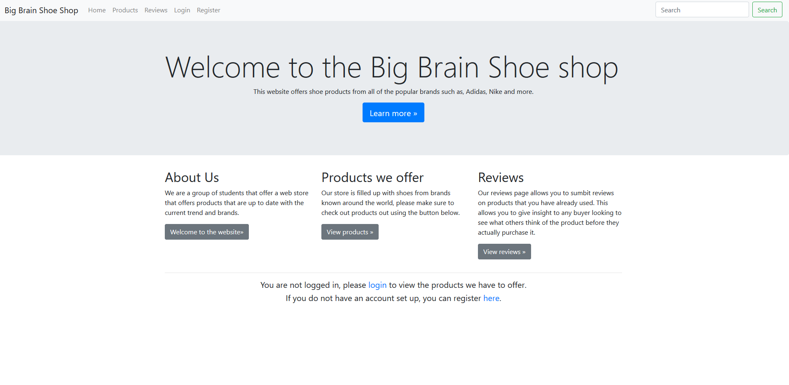
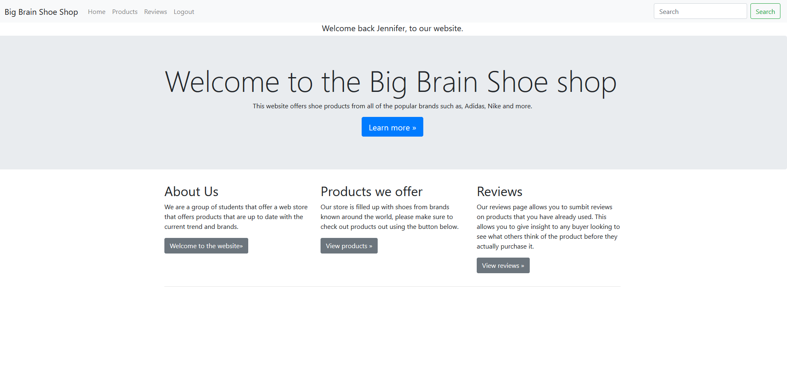
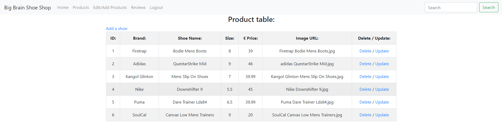
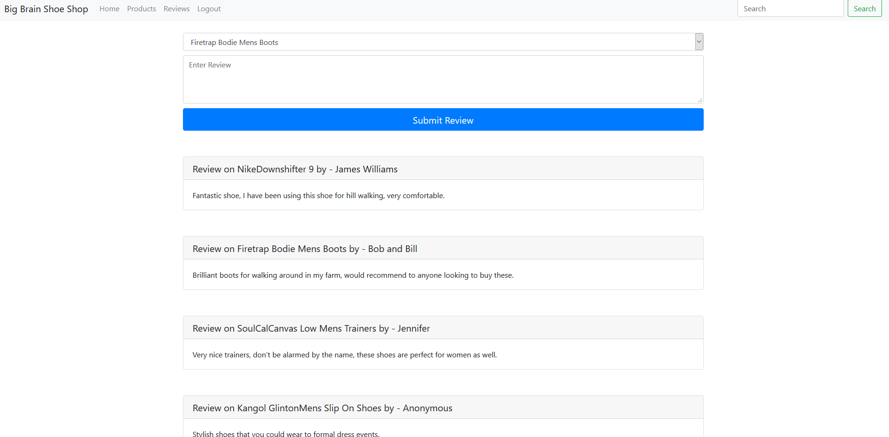

# Introduction
This project is a Shoe shop website built using an MVC Framework. It allows a user to sign up, login and logout, leave reviews and view products on offer.

The MVC framework works by a user requests a page, this request gets routed to a controller by the index.php, the controller then contacts the model which then gets any requested data from the database. The model then sends the data back to the controller, which then delivers it to the view which displays the webpage with the retrieved data.

This project uses 4 models, one for Login and registering, one for shoes and reviews.

# Feature List
* CRUD for Shoe's table
* Full login and registration system
* User Reviews
* Products Page
* Validation using AJAX

# How does the MVC work in this project?
For this I'll use the insert for the shoes table as a basic example:

```
$app->GET('/add-shoe',        'AddShoe');
$app->POST('/add-shoe',       'AddShoeProcess');
```

Here we can see the first argument is the URL and the other is the controller that is used. So when a user visits the for page for adding the shoe the the GET calls the AddShoe controller which then renders the page. 

```
$db = \Rapid\Database::getPDO();

$shoe = new Shoe([
    'name' => $req->body('name'),
    'brand' => $req->body('brand'),
    'size' => $req->body('size'),
    'price' => $req->body('price'),
    'url' => $req->body('url')
]);

$shoe->save($db);
```
```
public function save(PDO $pdo) {
   
    if(!($pdo instanceof PDO)) {
        throw new Exception('Invalid PDO object for Shoe save');

    }
        $stt = $pdo->prepare('INSERT INTO shoes (name, brand, size, price, url) 
        VALUES (:name, :brand, :size, :price, :url)');
        $stt->execute([
            'name' => $this->getName(),
            'brand' => $this->getBrand(),
            'size' => $this->getSize(),
            'price' => $this->getPrice(),
            'url' => $this->getURL()
        ]);

        $saved = $stt->rowCount() === 1;

        return $saved;

}
```

When the form is submitted the POST sends the data to the AddShoeProcess controller which then sends the posted data to the Shoe model which is passed to the save function which then does validation before inserting the new shoe into the database. And that is brief overview of how the MVC framework functions in our project.

# What can a User do?
When a user first visits the website the will see the homepage with a login and register button in the nav bar. When they have logged in/signed up, the login and register buttons are replaced with a logout button.





Managers(who have hardcoded entries in the database, i.e signing up does not give you the ability the be a manager) can also see the add shoes and display shoes pages.




Reviews can be left by users and non-users(who are called anonymous).




# How to set up this project

Download the repository and create a file called config.php in the root of the project and copy the contents of config.php.sample and fill in your values.

# To-do List

1. Add to cart and checkout system.
2. Better validation for the Shoe Model.
3. Search function with filters.
4. Incorporate Ajax into validation, i.e when registering a user, it updates in real time telling them whether or not it is valid.
5. Seperate Ajax into a seperate file, and add more Ajax validation to other forms.
6. Allow managers to delete reviews.

# Sources

* https://www.w3schools.com/bootstrap/tryit.asp?filename=trybs_temp_store&stacked=h
* https://getbootstrap.com/docs/4.0/components/forms/
* https://getbootstrap.com/docs/4.0/components/carousel/
* https://v4-alpha.getbootstrap.com/examples/
* https://stackoverflow.com/questions/4517067
* https://www.sportsdirect.com/
* https://getbootstrap.com/docs/4.3/components/card/
* https://2019-moodle.dkit.ie/mod/url/view.php?id=288367
* https://2019-moodle.dkit.ie/mod/url/view.php?id=290833
* https://2019-moodle.dkit.ie/mod/url/view.php?id=290835
* https://www.youtube.com/watch?v=L7Sn-f36TGM 